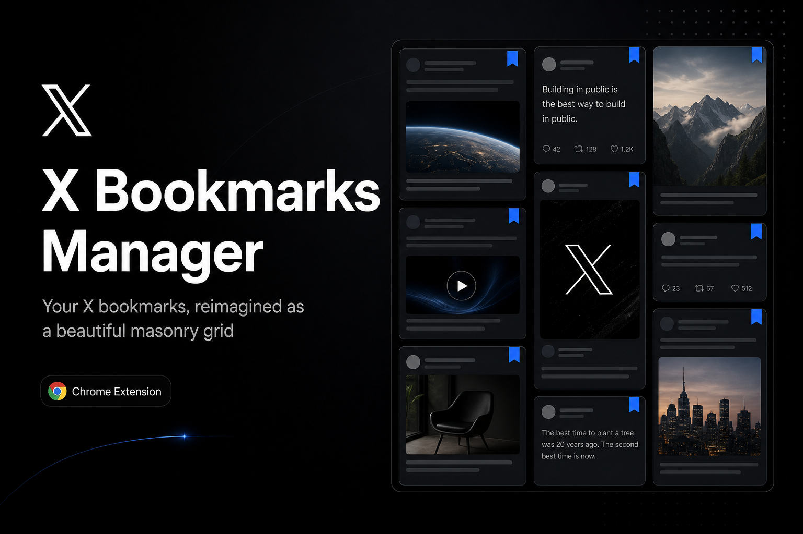

<div align="center">



# X Bookmarks Manager

**A free Chrome extension that turns your X (Twitter) bookmarks into a modern masonry view.**

Search, filter by author, export to JSON, and auto-load all pages — all in one clean interface.

**English** · [Türkçe](README.tr.md)

[Installation](#-installation) · [Features](#-features) · [Privacy](#-privacy)

</div>

---

## ⬇️ Installation

> The extension is not on the Chrome Web Store yet; you can install it easily with the steps below.

1. **Download:** Click the green **`Code`** button at the top of this page → **Download ZIP** and extract it on your computer.
   _(or: `git clone https://github.com/sarisen/x-bookmark-manager.git`)_
2. Open **`chrome://extensions`** in Chrome's address bar.
3. Enable **Developer mode** from the top right.
4. Click **Load unpacked** and select the extracted **`x-bookmark-manager`** folder.
5. Open [x.com/i/bookmarks](https://x.com/i/bookmarks) — the new interface is ready! 🎉

## ✨ Features

- 🧱 **Masonry grid** — bookmarks grouped into cards by month
- 🔍 **Search** and an **Authors** tab for quick filtering
- ⏬ **Load All** — automatically fetches every page with a configurable delay (default 3s)
- 🗑️ **Remove bookmark** — directly from the card
- 📤 **Export to JSON** — your data stays entirely with you
- ⚙️ **Settings** — wait time between pages (1–60s)

## ⚙️ Settings

**Right-click the extension icon → Options**, or use the **gear icon** on the bookmarks page.

## 🔒 Privacy

All data is processed **only in your browser**; nothing is sent to any external server and no analytics/telemetry is used. Details: [PRIVACY.md](PRIVACY.md)

## 🧩 Project structure

```
├── manifest.json
├── content/
│   ├── content.js    # UI
│   ├── inject.js     # X API capture
│   ├── parser.js
│   └── styles.css
├── options/          # Settings page
├── icons/            # Extension icons
└── assets/           # Promotional images
```

## 📄 License

MIT
